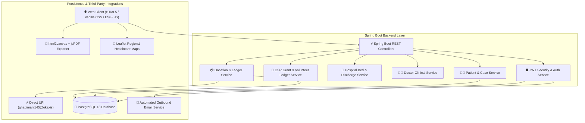

# 🏥 Vishwasa Healthcare Foundation — Enterprise Medical Relief & Governance Platform

<div align="center">


### **Hope, Healing & Humanity.**
*A Section 8 Registered Non-Profit Healthcare & Medical Crowdfunding Platform*  
**Belagavi Headquarters • Serving North Karnataka**

[](https://www.oracle.com/java/)
[](https://spring.io/projects/spring-boot)
[](https://www.postgresql.org/)
[](https://leafletjs.com/)
[](#)

</div>

---

## 📖 Executive Summary

**Vishwasa Healthcare Foundation** is an enterprise-grade digital health governance and medical crowdfunding platform operating across North Karnataka (Belagavi, Hubballi-Dharwad, Vijayapura, Bagalkote, Haveri, Gadag).

The platform bridges critical healthcare gaps by combining **door-to-door volunteer field audits**, **specialist doctor clinical evaluations**, **Foundation Admin hospital allocations**, **5-stage clinical treatment lifecycle tracking**, **100% direct hospital fund disbursement**, and **corporate CSR grant management**.

---

## 🏗️ System Architecture



---

## 🌟 Core Modules & Enterprise Features

### 1. 📋 Verified Patient Store & 5-Stage Clinical Treatment Lifecycle
- **Approved Patients Registry:** Approved patients are automatically indexed into the **Verified & Approved Patients Store**.
- **5-Stage Clinical Lifecycle:**
  1. 📄 **Document Audit Approved** — Identity and medical documents verified by Foundation Board.
  2. 🏥 **Partner Hospital Allocated** — Allocated to an accredited super-speciality hospital.
  3. 🩺 **Clinical Evaluation & Surgery** — Medical board review and active surgical operation.
  4. 💚 **Fund Disbursed & Recovery** — Direct hospital disbursement and ICU recovery monitoring.
  5. 🎉 **Fit for Discharge & Closed** — Patient fully recovered and discharged with itemized bill receipt.
- **Stage Progress Tracking:** Features a gradient stage progress bar with 1-click stage advancement (`⚡ Advance Stage`) and instant PDF summary generation.

### 2. 🏥 Partner Hospital Allocation Engine
- **Centralized Hospital Allocation:** Patients register without selecting a hospital; accredited hospitals are allocated by Foundation Board Admin upon document verification audit.
- **Accredited Network Hospitals:**
  - *KLES Dr. Prabhakar Kore Hospital (Belagavi)*
  - *Tatwadarsha Hospital (Hubballi-Dharwad)*
  - *SDM Medical College & Hospital (Dharwad)*
  - *BLDE Shri B. M. Patil Medical College (Vijayapura)*
- **Hospital Admin Dashboard Sync:** Allocated patients immediately reflect in the **Hospital Admin Dashboard** (`role === 'HOSPITAL_ADMIN'`) for bed assignment and surgical admission.

### 3. 👥 Nearby Field Volunteer Inspector Allocation
- **District-Based Proximity Allocation:** Foundation Admin allocates nearby field volunteer inspectors based on geographic district location.
- **Volunteer Field Dashboard Sync:** Assigned audit tasks sync directly to the **Field Volunteer Inspector Dashboard** (`role === 'VOLUNTEER'`) with 1-click house verification completion and audit PDF generation.

### 4. 🛡️ Mandatory Identity Document Audit Queue
- **Non-Donor Verification:** Every Patient, Volunteer, Doctor, and ASHA Worker must submit a valid identity document (Aadhaar Card, BPL Ration Card, EPIC Voter ID, KMC Registration License).
- **Foundation Board Audit Queue:** New accounts are held in status `PENDING_FOUNDATION_APPROVAL` for board audit.
- **Automated Outbound Email Trigger:** Account approval dispatches a welcome authorization email to the user.

### 5. 🏢 Corporate CSR Sponsor & 80G Tax Exemption
- **Corporate CSR Grants:** Manages corporate healthcare MoUs and grants (e.g., Infosys Foundation, Wipro Cares, TCS Foundation).
- **Exclusive 80G Corporate Tax Exemption:** 80G tax exemption certificates under Section 80G of the Income Tax Act 1961 are reserved exclusively for Corporate CSR Sponsors and Grants.
- **Volunteer Stipend Ledger:** Manages honorarium payments (`TX-CSR-501`) for rural field inspectors.

### 6. 💳 Direct UPI Payment Engine & Automatic PDF Receipts
- **Target UPI VPA:** Configured to target UPI ID **`ghadimani145@okaxis`** with dynamic QR generation and deep-linking support for UPI apps (GPay, PhonePe, Paytm).
- **Auto PDF Generation:** Submitting a UPI donation automatically generates and downloads an official **Patient Aid Payment & Donation Receipt PDF**.

### 7. 📍 Regional Healthcare Coverage Map
- **Regional Coverage Pins:** Interactive map markers showcasing accredited partner hospitals and active field volunteers across North Karnataka.

---

## 👥 8 Specialized User Role Portals

| Role Portal | Portal Capabilities | Access Level |
| :--- | :--- | :--- |
| **🧑‍🦽 Patient** | Case progress, assigned hospital, UIDAI audit status & Discharge Bill PDF | Authenticated Patient |
| **💖 Donor** | Donated fund tracker, direct hospital disbursement ledger & payment receipts | Authenticated Donor |
| **👤 Volunteer** | Assigned physical verification audits, house inspection & field report PDF | Field Volunteer |
| **👨‍⚕️ Doctor** | KMC License verification, clinical evaluation & surgical report submission | Medical Specialist |
| **🏥 Hospital Admin** | Allocated patient admissions, bed management & itemized discharge billing | Hospital Authority |
| **🛡️ Foundation Admin** | **Approved Patients Table**, Hospital Allocation, Volunteer Assignment & Audit Queue | Executive Board |
| **👩‍⚕️ ASHA Worker** | Rural patient referrals, volunteer zone approvals & community health drives | Healthcare Field Lead |
| **🏢 CSR Sponsor** | Corporate grant commitment, 80G tax exemption certificates & CSR MoU tracking | Corporate CSR Board |

---

## 🐘 PostgreSQL Database Architecture

The platform uses **PostgreSQL 18** with automated schema initialization on startup.

### Key Database Tables:
- `users` — Authentication credentials, role definitions, and account approval statuses.
- `patients` — Patient identity data, UIDAI document references, and assigned case numbers.
- `volunteers` — Field volunteer profiles, assigned zones, and verification audit logs.
- `doctors` — Specialist doctor profiles, KMC registration numbers, and hospital affiliations.
- `hospitals` — Accredited hospital records, bed capacity, and billing accounts.
- `medical_cases` — Active medical campaigns, clinical diagnosis, and surgical costs.
- `donations` — Transaction ledger storing donor info, payment references, and direct disbursement status.

---

## 📡 REST API Architecture

### 🔑 Authentication Endpoints
- `POST /api/auth/login` — Authenticate user credentials and issue JWT token.
- `POST /api/auth/register` — Register user account with identity document payload.
- `GET /api/auth/me` — Fetch authenticated user profile.

### 🧑‍🦽 Patient & Clinical Endpoints
- `POST /api/patients/register` — Register new patient and queue for Foundation Board audit.
- `GET /api/patients/{id}` — Fetch patient clinical details and treatment status.
- `POST /api/patients/{id}/cases` — Create medical aid case for allocated hospital.

### 💳 Donation & Ledger Endpoints
- `POST /api/donations` — Record verified donation in PostgreSQL database.
- `GET /api/donations/campaign/{campaignId}` — Fetch donations for a medical campaign.
- `GET /api/donations/donor/{email}` — Fetch donation history for a donor.

---

## ⚙️ Configuration & Local Deployment

### Database Configuration
Configure database connection settings in `src/main/resources/application.properties`:
```properties
# PostgreSQL Database Connection Settings
spring.datasource.url=${SPRING_DATASOURCE_URL:jdbc:postgresql://localhost:5432/vishwasa}
spring.datasource.username=${SPRING_DATASOURCE_USERNAME:postgres}
spring.datasource.password=${SPRING_DATASOURCE_PASSWORD:your_database_password}

# JWT Token Security Configuration
jwt.secret=${JWT_SECRET_KEY:VishwasaHealthcareFoundationSuperSecretKey2026NorthKarnatakaBelagaviHQ98450SecureJWTTokenSigningKey32BytesLong}
```

### Launch Application
```powershell
# Set JAVA_HOME and run Spring Boot Application
$env:JAVA_HOME="C:\Program Files\JetBrains\IntelliJ IDEA 2026.2.1\jbr"
mvn spring-boot:run
```

Access Web Portal:  
🔗 **`http://localhost:8080`**

---

## 📦 Production Packaging

Build executable Spring Boot JAR package:
```powershell
mvn clean package -DskipTests
```
Output artifact: **`target/vishwasa-1.0.0.jar`**

---

## 📜 License & Copyright
Copyright © 2026 **Vishwasa Healthcare Foundation** — Section 8 Registered Non-Profit NGO. Belagavi Headquarters, North Karnataka. All Rights Reserved.
