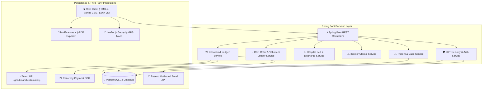

# 🏥 Vishwasa Healthcare Foundation — Enterprise Medical Relief & Governance Platform

<div align="center">


### **Hope, Healing & Humanity.**
*A Section 8 Registered Non-Profit Healthcare & Medical Crowdfunding Platform*
**Belagavi Headquarters • Serving North Karnataka**

[](https://www.oracle.com/java/)
[](https://spring.io/projects/spring-boot)
[](https://www.postgresql.org/)
[](https://www.geoapify.com/)
[](https://razorpay.com/)
[](#)

</div>

---

## 📖 Executive Summary

**Vishwasa Healthcare Foundation** is an enterprise-grade digital health governance and medical crowdfunding platform operating across North Karnataka (Belagavi, Hubballi-Dharwad, Vijayapura, Bagalkote). 

The platform bridges critical healthcare gaps by combining **door-to-door volunteer field audits**, **specialist doctor clinical evaluations**, **100% direct hospital disbursement**, and **corporate CSR grant management**.

---

## 🏗️ System Architecture



---

## 🌟 Core Modules & Enterprise Features

### 1. 🛡️ Mandatory Legitimate Document Verification & Board Audit Queue
- **Non-Donor Identity Audit:** Every Patient, Volunteer, Doctor, and ASHA Worker registering on the platform must submit a legitimate identity document:
  - **Patients:** Aadhaar Card (12-Digit UIDAI) / BPL Ration Card / Ayushman Bharat Card
  - **Volunteers:** Voter ID Card (EPIC) / Aadhaar Card / Driving License
  - **Doctors:** Karnataka Medical Council (KMC) Registration Certificate / National Medical Commission (NMC) License
- **Executive Board Approval Queue:** Accounts are created with status `PENDING_FOUNDATION_APPROVAL` and queued in the **Foundation Admin Dashboard** (`admin@vishwasa.org`) and **ASHA Worker Verification Desk**.
- **Automated Outbound Email Trigger:** Approving an account automatically dispatches a role-customized welcome & sign-in authorization email via the **Resend API**.

### 2. 🏥 Hospital Bed Allocation & Itemized Discharge Billing
- **Hospital Bed Tracking:** Hospital Admin (`hospital.admin@vishwasa.org`) manages active patient bed allocations (e.g. `ICU-Bed #04`, `Cardiac-Ward Bed #12`) and surgical procedures.
- **⚡ Complete Treatment & Discharge:** Clicking **`Discharge & Generate Bill`** marks the patient's treatment complete and auto-generates the **Itemized Hospital Discharge Bill Receipt PDF**.
- **Multi-Portal Real-Time Synchronization:**
  - **Hospital Admin:** Updates status to `✅ DISCHARGED & PAID`.
  - **Foundation Admin:** Disbursed & completed ledger update.
  - **Patient Portal:** Displays `✅ FIT FOR DISCHARGE` with downloadable itemized bill PDF.
  - **Donor Portal:** Displays completed treatment discharge receipt for supported cases.

### 3. 🏢 Corporate CSR Sponsor & Volunteer Honorarium Ledger
- **CSR Grant Management:** Manages corporate grants (e.g., Infosys Foundation ₹50,00,000, Wipro Cares ₹35,00,000).
- **Volunteer Stipend Ledger:** Tracks stipend & honorarium transactions (`TX-CSR-501`) paid to field inspectors for conducting door-to-door rural verification audits.
- **Village Health Campaigns:** Tracks CSR-funded outreach (Maternal Antenatal Care, Menstrual Hygiene Kit Distribution, Pediatric Cardiac Surgeries).

### 4. 💳 Razorpay Gateway & Direct UPI Integration
- **Razorpay Interactive Modal Window (`#razorpayModalWindow`):** Official modal supporting Credit/Debit Cards, UPI, and Netbanking.
- **Target UPI Payment VPA:** Direct UPI transfers configured to **`ghadimani145@okaxis`** with live QR code generation (`api.qrserver.com`) and GPay/PhonePe deep linking.
- **50% Tax Exemption (80G):** Auto-generates official 80G tax exemption receipts under Section 80G of the Income Tax Act 1961.

### 5. 📍 Real Geoapify GPS District Map Engine
- **Geoapify Tile Integration:** Powered by Geoapify API Key `bb0bf950c55c4be0ac393f97a43ea670` & Leaflet.js tiles.
- **Interactive Pins:** Interactive GPS map markers for accredited partner hospitals (🏥) and field volunteers (👤) across Belagavi, Hubballi-Dharwad, Vijayapura, and Bagalkote.

---

## 👥 8 Specialized User Role Portals

| Role | Username / Email | Password | Primary Portal Capabilities |
| :--- | :--- | :--- | :--- |
| **🧑‍🦽 Patient** | `patient@vishwasa.org` | `password123` | Case progress, assigned hospital, UIDAI audit status & Discharge Bill PDF |
| **💖 Donor** | `donor@vishwasa.org` | `password123` | Donated fund tracker, 80G tax savings calculator & PDF tax receipts |
| **👤 Volunteer** | `volunteer.belagavi@vishwasa.org` | `password123` | Door-to-door verification audits & field report generation |
| **👨‍⚕️ Doctor** | `doctor.kles@vishwasa.org` | `password123` | KMC Certificate verification & clinical treatment report generation |
| **🏥 Hospital Admin** | `hospital.admin@vishwasa.org` | `password123` | Bed allocation, ICU tracking & itemized discharge bill generation |
| **🛡️ Foundation Admin** | `admin@vishwasa.org` | `password123` | **Pending User Approvals Queue**, CSR MoU management & direct fund transfers |
| **👩‍⚕️ ASHA Worker** | `asha.belagavi@vishwasa.org` | `password123` | Rural patient referrals, volunteer zone approvals & health camp drives |
| **🏢 CSR Sponsor** | `csr.sponsor@vishwasa.org` | `password123` | Corporate grant allocation, volunteer stipend transactions & impact metrics |

---

## 🐘 PostgreSQL Database & Schema Architecture

The platform uses **PostgreSQL 18** with automatic seeding on startup via `DatabaseInitializer.java`.

### Key Tables & Entities:
- `users`: Core authentication & 8-role security definitions.
- `patients`: Patient profiles, UIDAI Aadhaar verification, and assigned cases.
- `volunteers`: Field volunteer profiles, assigned districts, and reliability scores.
- `doctors`: Specialist doctors, KMC registration numbers, and medical qualifications.
- `hospitals`: Accredited partner hospitals, bed capacity, and billing departments.
- `medical_cases`: Medical aid cases, surgery costs, and recovery status.
- `donation_campaigns`: Active fundraising campaigns and target goals.
- `donations`: Transaction ledger storing donor PAN numbers, amounts, and UTR references.

---

## 📡 REST API Documentation Endpoints

### 🔑 Authentication Endpoints
- `POST /api/auth/login` — Authenticate user and issue JWT token.
- `POST /api/auth/register` — Register user account with password and document audit payload.
- `GET /api/auth/me` — Fetch current authenticated user.

### 🧑‍🦽 Patient & Case Endpoints
- `POST /api/patients/register` — Register new patient and queue for Foundation Admin approval.
- `GET /api/patients/{id}` — Get patient details.
- `POST /api/patients/{id}/cases` — Create new medical case for patient.

### 💳 Donation & Ledger Endpoints
- `POST /api/donations` — Create completed donation record in PostgreSQL.
- `GET /api/donations/campaign/{campaignId}` — Get all donations for a specific campaign.
- `GET /api/donations/donor/{email}` — Get donation history by donor email.

---

## ⚙️ Configuration & Environment Setup

### Local Setup
Ensure PostgreSQL 18 is running locally on port `5432`:
```properties
# src/main/resources/application.properties
spring.datasource.url=${SPRING_DATASOURCE_URL:jdbc:postgresql://localhost:5432/vishwasa}
spring.datasource.username=${SPRING_DATASOURCE_USERNAME:postgres}
spring.datasource.password=${SPRING_DATASOURCE_PASSWORD:Girish@9701}
jwt.secret=${JWT_SECRET_KEY:${JWT_SECRET:VishwasaHealthcareFoundationSuperSecretKey2026NorthKarnatakaBelagaviHQ98450SecureJWTTokenSigningKey32BytesLong}}
```

### Launch Application
```powershell
# Set JAVA_HOME and run Spring Boot Application
$env:JAVA_HOME="C:\Program Files\JetBrains\IntelliJ IDEA 2026.2.1\jbr"
mvn spring-boot:run
```

Access Web Portal:
🔗 **`http://localhost:8080`**

---

## 📦 Production Build & Packaging

Build executable JAR package for cloud deployment:
```powershell
mvn clean package -DskipTests
```
Output artifact: **`target/vishwasa-1.0.0.jar`**

---

## 📜 License & Copyright
Copyright © 2026 **Vishwasa Healthcare Foundation** — Section 8 Registered Non-Profit NGO. Belagavi Headquarters, North Karnataka. All Rights Reserved.
